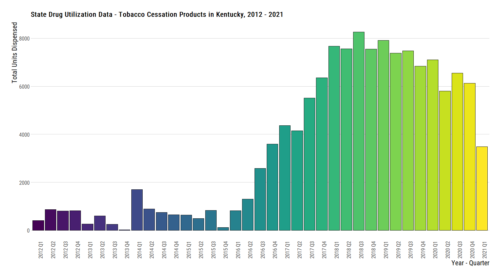

State Drug Utilization - Tobacco Cessation in Kentucky
================
Michael Q. Maguire, MS
February 17, 2022

## Packages Used

``` r
library(tidyverse)
library(data.table)
library(DT)
library(rvest)
library(hrbrthemes)
library(readxl)
```

## Read in the SDUD data set

``` r
sdud <- fread(
  file_location,
  colClasses = c('proper_ndc' = 'character')
)
```

## Read in AG NDC file.

## Subset to Florida Only and Create MOUD Flags

``` r
ndc <- readxl::read_excel('./data/raw/Chantix varenicline NDC codes.xlsx')

ndc_patterns <- ndc |>
  tidyr::separate('Chantix_Varenicline_NDC', into = c('code1', 'code2', 'code3'), sep = '-', remove = FALSE) |>
  mutate(
    pattern = paste0(nchar(trimws(code1)), nchar(trimws(code2)), nchar(trimws(code3))),
    ndcnum = case_when(
      pattern == '532' ~ paste0(code1, paste0("0", code2), code3),
      pattern == '442' ~ paste0(paste0("0", code1), code2, code3),
      pattern == '443' ~ paste0(paste0("0", code1), code2, code3),
      pattern == '541' ~ paste0(code1, code2, paste0("0", code3)),
      TRUE ~ 'Pattern not matched'
    )
  )

ndc_chantix <- ndc_patterns$ndcnum
```

Variable `moudFlag` represents whether the brand name has a pattern
match with the below values. Variable `medication` represents the
categorization according to AG.

``` r
sdudTobacco <- sdud[
  i = (data.table::between(year, 2012, 2021) & proper_ndc %in% ndc_chantix),
  j = .(utilization.type, state, year, quarter, suppression, proper_ndc, gennme, prodnme, numberrx)
][,
  `:=` (yearQuarter = zoo::as.yearqtr(format(paste0(year, quarter)), "%Y%q"))
  ]
```

The following NDC’s were found in this data base:

``` r
received_ndc <- length(ndc_chantix)
matched_ndc <- length(unique(sdudTobacco$proper_ndc))

paste0("Proportion matched to SDUD: ", round(matched_ndc / received_ndc, 2))
```

    ## [1] "Proportion matched to SDUD: 0.27"

## Aggregating overall numbers by State

``` r
sdudTobaccoAggState <- sdudTobacco[
  i = suppression == 'F',
  j = .(totalRX = sum(numberrx)),
  by = .(yearQuarter, state)]

setorder(sdudTobaccoAggState, state, yearQuarter)
```

``` r
sdudTobaccoAggState |> filter(state == 'KY') |>
  ggplot() +
  geom_col(aes(x = as.factor(yearQuarter), y = totalRX, fill = as.factor(yearQuarter)), color = 'black') +
  ggtitle("State Drug Utilization Data - Tobacco Cessation Products in Kentucky, 2012 - 2021") +
  xlab('Year - Quarter') +
  ylab('Total Units Dispensed') +
  theme_ipsum_rc(grid = 'Y') +
  theme(axis.text.x = element_text(angle = 90, size = 14),
        axis.text.y = element_text(size = 14),
        axis.title.x = element_text(size = 18),
        axis.title.y = element_text(size = 18),
        legend.position = 'none') +
  scale_fill_viridis_d()
```

<!-- -->

## Other States

``` r
noKy <- sdudTobaccoAggState[sdudTobaccoAggState$state != 'KY', ]
noKyFormatted <- copy(noKy)
noKyFormatted <- noKyFormatted[,  `:=` (yearQtrF = as.character(yearQuarter), yearQuarter = NULL)][, j = .(state, yearQtrF, totalRX)]
datatable(noKyFormatted)
```

<div id="htmlwidget-fc376b546be84a2ba1dd" style="width:100%;height:auto;" class="datatables html-widget"></div>
<script type="application/json" data-for="htmlwidget-fc376b546be84a2ba1dd">{"x":{"filter":"none","vertical":false,"data":[["1","2","3","4","5","6","7","8","9","10","11","12","13","14","15","16","17","18","19","20","21","22","23","24","25","26","27","28","29","30","31","32","33","34","35","36","37","38","39","40","41","42","43","44","45","46","47","48","49","50","51","52","53","54","55","56","57","58","59","60","61","62","63","64","65","66","67","68","69","70","71","72","73","74","75","76","77","78","79","80","81","82","83","84","85","86","87","88","89","90","91","92","93","94","95","96","97","98","99","100","101","102","103","104","105","106","107","108","109","110","111","112","113","114","115","116","117","118","119","120","121","122","123","124","125","126","127","128","129","130","131","132","133","134","135","136","137","138","139","140","141","142","143","144","145","146","147","148","149","150","151","152","153","154","155","156","157","158","159","160","161","162","163","164","165","166","167","168","169","170","171","172","173","174","175","176","177","178","179","180","181","182","183","184","185","186","187","188","189","190","191","192","193","194","195","196","197","198","199","200","201","202","203","204","205","206","207","208","209","210","211","212","213","214","215","216","217","218","219","220","221","222","223","224","225","226","227","228","229","230","231","232","233","234","235","236","237","238","239","240","241","242","243","244","245","246","247","248","249","250","251","252","253","254","255","256","257","258","259","260","261","262","263","264","265","266","267","268","269","270","271","272","273","274","275","276","277","278","279","280","281","282","283","284","285","286","287","288","289","290","291","292","293","294","295","296","297","298","299","300","301","302","303","304","305","306","307","308","309","310","311","312","313","314","315","316","317","318","319","320","321","322","323","324","325","326","327","328","329","330","331","332","333","334","335","336","337","338","339","340","341","342","343","344","345","346","347","348","349","350","351","352","353","354","355","356","357","358","359","360","361","362","363","364","365","366","367","368","369","370","371","372","373","374","375","376","377","378","379","380","381","382","383","384","385","386","387","388","389","390","391","392","393","394","395","396","397","398","399","400","401","402","403","404","405","406","407","408","409","410","411","412","413","414","415","416","417","418","419","420","421","422","423","424","425","426","427","428","429","430","431","432","433","434","435","436","437","438","439","440","441","442","443","444","445","446","447","448","449","450","451","452","453","454","455","456","457","458","459","460","461","462","463","464","465","466","467","468","469","470","471","472","473","474","475","476","477","478","479","480","481","482","483","484","485","486","487","488","489","490","491","492","493","494","495","496","497","498","499","500","501","502","503","504","505","506","507","508","509","510","511","512","513","514","515","516","517","518","519","520","521","522","523","524","525","526","527","528","529","530","531","532","533","534","535","536","537","538","539","540","541","542","543","544","545","546","547","548","549","550","551","552","553","554","555","556","557","558","559","560","561","562","563","564","565","566","567","568","569","570","571","572","573","574","575","576","577","578","579","580","581","582","583","584","585","586","587","588","589","590","591","592","593","594","595","596","597","598","599","600","601","602","603","604","605","606","607","608","609","610","611","612","613","614","615","616","617","618","619","620","621","622","623","624","625","626","627","628","629","630","631","632","633","634","635","636","637","638","639","640","641","642","643","644","645","646","647","648","649","650","651","652","653","654","655","656","657","658","659","660","661","662","663","664","665","666","667","668","669","670","671","672","673","674","675","676","677","678","679","680","681","682","683","684","685","686","687","688","689","690","691","692","693","694","695","696","697","698","699","700","701","702","703","704","705","706","707","708","709","710","711","712","713","714","715","716","717","718","719","720","721","722","723","724","725","726","727","728","729","730","731","732","733","734","735","736","737","738","739","740","741","742","743","744","745","746","747","748","749","750","751","752","753","754","755","756","757","758","759","760","761","762","763","764","765","766","767","768","769","770","771","772","773","774","775","776","777","778","779","780","781","782","783","784","785","786","787","788","789","790","791","792","793","794","795","796","797","798","799","800","801","802","803","804","805","806","807","808","809","810","811","812","813","814","815","816","817","818","819","820","821","822","823","824","825","826","827","828","829","830","831","832","833","834","835","836","837","838","839","840","841","842","843","844","845","846","847","848","849","850","851","852","853","854","855","856","857","858","859","860","861","862","863","864","865","866","867","868","869","870","871","872","873","874","875","876","877","878","879","880","881","882","883","884","885","886","887","888","889","890","891","892","893","894","895","896","897","898","899","900","901","902","903","904","905","906","907","908","909","910","911","912","913","914","915","916","917","918","919","920","921","922","923","924","925","926","927","928","929","930","931","932","933","934","935","936","937","938","939","940","941","942","943","944","945","946","947","948","949","950","951","952","953","954","955","956","957","958","959","960","961","962","963","964","965","966","967","968","969","970","971","972","973","974","975","976","977","978","979","980","981","982","983","984","985","986","987","988","989","990","991","992","993","994","995","996","997","998","999","1000","1001","1002","1003","1004","1005","1006","1007","1008","1009","1010","1011","1012","1013","1014","1015","1016","1017","1018","1019","1020","1021","1022","1023","1024","1025","1026","1027","1028","1029","1030","1031","1032","1033","1034","1035","1036","1037","1038","1039","1040","1041","1042","1043","1044","1045","1046","1047","1048","1049","1050","1051","1052","1053","1054","1055","1056","1057","1058","1059","1060","1061","1062","1063","1064","1065","1066","1067","1068","1069","1070","1071","1072","1073","1074","1075","1076","1077","1078","1079","1080","1081","1082","1083","1084","1085","1086","1087","1088","1089","1090","1091","1092","1093","1094","1095","1096","1097","1098","1099","1100","1101","1102","1103","1104","1105","1106","1107","1108","1109","1110","1111","1112","1113","1114","1115","1116","1117","1118","1119","1120","1121","1122","1123","1124","1125","1126","1127","1128","1129","1130","1131","1132","1133","1134","1135","1136","1137","1138","1139","1140","1141","1142","1143","1144","1145","1146","1147","1148","1149","1150","1151","1152","1153","1154","1155","1156","1157","1158","1159","1160","1161","1162","1163","1164","1165","1166","1167","1168","1169","1170","1171","1172","1173","1174","1175","1176","1177","1178","1179","1180","1181","1182","1183","1184","1185","1186","1187","1188","1189","1190","1191","1192","1193","1194","1195","1196","1197","1198","1199","1200","1201","1202","1203","1204","1205","1206","1207","1208","1209","1210","1211","1212","1213","1214","1215","1216","1217","1218","1219","1220","1221","1222","1223","1224","1225","1226","1227","1228","1229","1230","1231","1232","1233","1234","1235","1236","1237","1238","1239","1240","1241","1242","1243","1244","1245","1246","1247","1248","1249","1250","1251","1252","1253","1254","1255","1256","1257","1258","1259","1260","1261","1262","1263","1264","1265","1266","1267","1268","1269","1270","1271","1272","1273","1274","1275","1276","1277","1278","1279","1280","1281","1282","1283","1284","1285","1286","1287","1288","1289","1290","1291","1292","1293","1294","1295","1296","1297","1298","1299","1300","1301","1302","1303","1304","1305","1306","1307","1308","1309","1310","1311","1312","1313","1314","1315","1316","1317","1318","1319","1320","1321","1322","1323","1324","1325","1326","1327","1328","1329","1330","1331","1332","1333","1334","1335","1336","1337","1338","1339","1340","1341","1342","1343","1344","1345","1346","1347","1348","1349","1350","1351","1352","1353","1354","1355","1356","1357","1358","1359","1360","1361","1362","1363","1364","1365","1366","1367","1368","1369","1370","1371","1372","1373","1374","1375","1376","1377","1378","1379","1380","1381","1382","1383","1384","1385","1386","1387","1388","1389","1390","1391","1392","1393","1394","1395","1396","1397","1398","1399","1400","1401","1402","1403","1404","1405","1406","1407","1408","1409","1410","1411","1412","1413","1414","1415","1416","1417","1418","1419","1420","1421","1422","1423","1424","1425","1426","1427","1428","1429","1430","1431","1432","1433","1434","1435","1436","1437","1438","1439","1440","1441","1442","1443","1444","1445","1446","1447","1448","1449","1450","1451","1452","1453","1454","1455","1456","1457","1458","1459","1460","1461","1462","1463","1464","1465","1466","1467","1468","1469","1470","1471","1472","1473","1474","1475","1476","1477","1478","1479","1480","1481","1482","1483","1484","1485","1486","1487","1488","1489","1490","1491","1492","1493","1494","1495","1496","1497","1498","1499","1500","1501","1502","1503","1504","1505","1506","1507","1508","1509","1510","1511","1512","1513","1514","1515","1516","1517","1518","1519","1520","1521","1522","1523","1524","1525","1526","1527","1528","1529","1530","1531","1532","1533","1534","1535","1536","1537","1538","1539","1540","1541","1542","1543","1544","1545","1546","1547","1548","1549","1550","1551","1552","1553","1554","1555","1556","1557","1558","1559","1560","1561","1562","1563","1564","1565","1566","1567","1568","1569","1570","1571","1572","1573","1574","1575","1576","1577","1578","1579","1580","1581","1582","1583","1584","1585","1586","1587","1588","1589","1590","1591","1592","1593","1594","1595","1596","1597","1598","1599","1600","1601","1602","1603","1604","1605","1606","1607","1608","1609","1610","1611","1612","1613","1614","1615","1616","1617","1618","1619","1620","1621","1622","1623","1624","1625","1626","1627","1628","1629","1630","1631","1632","1633","1634","1635","1636","1637","1638","1639","1640","1641","1642","1643","1644","1645","1646","1647","1648","1649","1650","1651","1652","1653","1654","1655","1656","1657","1658","1659","1660","1661","1662","1663","1664","1665","1666","1667","1668","1669","1670","1671","1672","1673","1674","1675","1676","1677","1678","1679","1680","1681","1682","1683","1684","1685","1686","1687","1688","1689","1690","1691","1692","1693","1694","1695","1696","1697","1698","1699","1700","1701","1702","1703","1704","1705","1706","1707","1708","1709","1710","1711","1712","1713","1714","1715","1716","1717","1718","1719","1720","1721","1722","1723","1724","1725","1726","1727","1728","1729","1730","1731","1732","1733","1734","1735","1736","1737","1738","1739","1740","1741","1742","1743","1744","1745","1746","1747","1748","1749","1750","1751","1752","1753","1754","1755","1756","1757","1758","1759","1760","1761","1762","1763","1764","1765","1766","1767","1768","1769","1770","1771","1772","1773","1774","1775","1776","1777","1778","1779","1780","1781","1782","1783","1784","1785","1786"],["AK","AK","AK","AK","AK","AK","AK","AK","AK","AK","AK","AK","AK","AK","AK","AK","AK","AK","AK","AK","AK","AK","AK","AK","AK","AK","AK","AK","AK","AK","AK","AK","AK","AK","AK","AK","AK","AL","AL","AL","AL","AL","AL","AL","AL","AL","AL","AL","AL","AL","AL","AL","AL","AL","AL","AL","AL","AL","AL","AL","AL","AL","AL","AL","AL","AR","AR","AR","AR","AR","AR","AR","AR","AR","AR","AR","AR","AR","AR","AR","AR","AR","AR","AR","AR","AR","AR","AR","AR","AR","AR","AR","AR","AR","AR","AR","AR","AR","AR","AR","AR","AR","AZ","AZ","AZ","AZ","AZ","AZ","AZ","AZ","AZ","AZ","AZ","AZ","AZ","AZ","AZ","AZ","AZ","AZ","AZ","AZ","AZ","AZ","AZ","AZ","AZ","AZ","AZ","AZ","AZ","AZ","AZ","AZ","AZ","AZ","AZ","AZ","AZ","CA","CA","CA","CA","CA","CA","CA","CA","CA","CA","CA","CA","CA","CA","CA","CA","CA","CA","CA","CA","CA","CA","CA","CA","CA","CA","CA","CA","CA","CA","CA","CA","CA","CA","CA","CA","CA","CO","CO","CO","CO","CO","CO","CO","CO","CO","CO","CO","CO","CO","CO","CO","CO","CO","CO","CO","CO","CO","CO","CO","CO","CO","CO","CO","CO","CO","CO","CO","CO","CO","CO","CO","CO","CO","CT","CT","CT","CT","CT","CT","CT","CT","CT","CT","CT","CT","CT","CT","CT","CT","CT","CT","CT","CT","CT","CT","CT","CT","CT","CT","CT","CT","CT","CT","CT","CT","CT","CT","CT","CT","CT","DC","DC","DC","DC","DC","DC","DC","DC","DC","DC","DC","DC","DC","DC","DC","DC","DC","DC","DC","DC","DC","DC","DC","DC","DC","DC","DC","DC","DC","DC","DC","DC","DC","DC","DC","DC","DC","DE","DE","DE","DE","DE","DE","DE","DE","DE","DE","DE","DE","DE","DE","DE","DE","DE","DE","DE","DE","DE","DE","DE","DE","DE","DE","DE","DE","DE","DE","DE","DE","DE","FL","FL","FL","FL","FL","FL","FL","FL","FL","FL","FL","FL","FL","FL","FL","FL","FL","FL","FL","FL","FL","FL","FL","FL","FL","FL","FL","FL","FL","FL","FL","FL","FL","FL","FL","GA","GA","GA","GA","GA","GA","GA","GA","GA","GA","GA","GA","GA","GA","GA","GA","GA","GA","GA","GA","GA","GA","GA","GA","GA","GA","HI","HI","HI","HI","HI","HI","HI","HI","HI","HI","HI","HI","HI","HI","HI","HI","HI","HI","HI","HI","HI","HI","HI","HI","HI","HI","HI","HI","HI","HI","HI","HI","HI","HI","HI","HI","HI","IA","IA","IA","IA","IA","IA","IA","IA","IA","IA","IA","IA","IA","IA","IA","IA","IA","IA","IA","IA","IA","IA","IA","IA","IA","IA","IA","IA","IA","IA","IA","IA","IA","IA","IA","IA","IA","ID","ID","ID","ID","ID","ID","ID","ID","ID","ID","ID","ID","ID","ID","ID","ID","ID","ID","ID","ID","ID","ID","ID","ID","ID","ID","ID","ID","IL","IL","IL","IL","IL","IL","IL","IL","IL","IL","IL","IL","IL","IL","IL","IL","IL","IL","IL","IL","IL","IL","IL","IL","IL","IL","IL","IL","IL","IL","IL","IL","IL","IL","IL","IL","IL","IN","IN","IN","IN","IN","IN","IN","IN","IN","IN","IN","IN","IN","IN","IN","IN","IN","IN","IN","IN","IN","IN","IN","IN","IN","IN","IN","IN","IN","IN","IN","IN","IN","IN","IN","IN","IN","KS","KS","KS","KS","KS","KS","KS","KS","KS","KS","KS","KS","KS","KS","KS","KS","KS","KS","KS","KS","KS","KS","KS","KS","KS","KS","KS","KS","KS","KS","KS","KS","KS","KS","KS","LA","LA","LA","LA","LA","LA","LA","LA","LA","LA","LA","LA","LA","LA","LA","LA","LA","LA","LA","LA","LA","LA","LA","LA","LA","LA","LA","LA","LA","LA","LA","LA","LA","LA","LA","LA","LA","MA","MA","MA","MA","MA","MA","MA","MA","MA","MA","MA","MA","MA","MA","MA","MA","MA","MA","MA","MA","MA","MA","MA","MA","MA","MA","MA","MA","MA","MA","MA","MA","MA","MA","MA","MA","MA","MD","MD","MD","MD","MD","MD","MD","MD","MD","MD","MD","MD","MD","MD","MD","MD","MD","MD","MD","MD","MD","MD","MD","MD","MD","MD","MD","MD","MD","MD","MD","MD","MD","MD","MD","MD","MD","ME","ME","ME","ME","ME","ME","ME","ME","ME","ME","ME","ME","ME","ME","ME","ME","ME","ME","ME","ME","ME","ME","ME","ME","ME","ME","ME","ME","ME","ME","ME","ME","ME","ME","ME","ME","ME","MI","MI","MI","MI","MI","MI","MI","MI","MI","MI","MI","MI","MI","MI","MI","MI","MI","MI","MI","MI","MI","MI","MI","MI","MI","MI","MI","MI","MI","MI","MI","MI","MI","MI","MI","MI","MI","MN","MN","MN","MN","MN","MN","MN","MN","MN","MN","MN","MN","MN","MN","MN","MN","MN","MN","MN","MN","MN","MN","MN","MN","MN","MN","MN","MN","MN","MN","MN","MN","MN","MN","MN","MN","MN","MO","MO","MO","MO","MO","MO","MO","MO","MO","MO","MO","MO","MO","MO","MO","MO","MO","MO","MO","MO","MO","MO","MO","MO","MO","MO","MO","MO","MO","MO","MO","MO","MO","MO","MO","MO","MO","MS","MS","MS","MS","MS","MS","MS","MS","MS","MS","MS","MS","MS","MS","MS","MS","MS","MS","MS","MS","MS","MS","MS","MS","MS","MS","MS","MS","MS","MS","MS","MS","MS","MS","MS","MS","MS","MT","MT","MT","MT","MT","MT","MT","MT","MT","MT","MT","MT","MT","MT","MT","MT","MT","MT","MT","MT","MT","MT","MT","MT","MT","MT","MT","MT","MT","MT","MT","MT","MT","MT","MT","MT","MT","NC","NC","NC","NC","NC","NC","NC","NC","NC","NC","NC","NC","NC","NC","NC","NC","NC","NC","NC","NC","NC","NC","NC","NC","NC","NC","NC","NC","NC","NC","NC","NC","NC","NC","NC","NC","NC","ND","ND","ND","ND","ND","ND","ND","ND","ND","ND","ND","ND","ND","ND","ND","ND","ND","ND","ND","ND","ND","ND","ND","ND","ND","ND","ND","ND","ND","ND","ND","ND","ND","ND","NE","NE","NE","NE","NE","NE","NE","NE","NE","NE","NE","NE","NE","NE","NE","NE","NE","NE","NE","NE","NE","NE","NE","NE","NE","NE","NE","NE","NE","NE","NE","NE","NE","NE","NE","NE","NE","NH","NH","NH","NH","NH","NH","NH","NH","NH","NH","NH","NH","NH","NH","NH","NH","NH","NH","NH","NH","NH","NH","NH","NH","NH","NH","NH","NH","NH","NH","NH","NH","NH","NH","NJ","NJ","NJ","NJ","NJ","NJ","NJ","NJ","NJ","NJ","NJ","NJ","NJ","NJ","NJ","NJ","NJ","NJ","NJ","NJ","NJ","NJ","NJ","NJ","NJ","NJ","NJ","NJ","NJ","NJ","NJ","NJ","NJ","NJ","NJ","NJ","NJ","NM","NM","NM","NM","NM","NM","NM","NM","NM","NM","NM","NM","NM","NM","NM","NM","NM","NM","NM","NM","NM","NM","NM","NM","NM","NM","NM","NM","NM","NM","NM","NM","NM","NM","NM","NM","NV","NV","NV","NV","NV","NV","NV","NV","NV","NV","NV","NV","NV","NV","NV","NV","NV","NV","NV","NV","NV","NV","NV","NV","NV","NV","NV","NV","NV","NV","NV","NV","NV","NV","NV","NV","NV","NY","NY","NY","NY","NY","NY","NY","NY","NY","NY","NY","NY","NY","NY","NY","NY","NY","NY","NY","NY","NY","NY","NY","NY","NY","NY","NY","NY","NY","NY","NY","NY","NY","NY","NY","NY","NY","OH","OH","OH","OH","OH","OH","OH","OH","OH","OH","OH","OH","OH","OH","OH","OH","OH","OH","OH","OH","OH","OH","OH","OH","OH","OH","OH","OH","OH","OH","OH","OH","OH","OH","OH","OH","OH","OK","OK","OK","OK","OK","OK","OK","OK","OK","OK","OK","OK","OK","OK","OK","OK","OK","OK","OK","OK","OK","OK","OK","OK","OK","OK","OK","OK","OK","OK","OK","OK","OK","OK","OK","OK","OK","OR","OR","OR","OR","OR","OR","OR","OR","OR","OR","OR","OR","OR","OR","OR","OR","OR","OR","OR","OR","OR","OR","OR","OR","OR","OR","OR","OR","OR","OR","OR","OR","OR","OR","OR","OR","OR","PA","PA","PA","PA","PA","PA","PA","PA","PA","PA","PA","PA","PA","PA","PA","PA","PA","PA","PA","PA","PA","PA","PA","PA","PA","PA","PA","PA","PA","PA","PA","PA","PA","PA","PA","PA","PA","RI","RI","RI","RI","RI","RI","RI","RI","RI","RI","RI","RI","RI","RI","RI","RI","RI","RI","RI","RI","RI","RI","RI","RI","RI","SC","SC","SC","SC","SC","SC","SC","SC","SC","SC","SC","SC","SC","SC","SC","SC","SC","SC","SC","SC","SC","SC","SC","SC","SC","SC","SC","SC","SC","SC","SC","SC","SC","SC","SC","SC","SC","SD","SD","SD","SD","SD","SD","SD","SD","SD","SD","SD","SD","SD","SD","SD","SD","SD","SD","SD","SD","SD","SD","SD","SD","SD","SD","SD","SD","SD","SD","SD","SD","SD","SD","SD","SD","SD","TN","TN","TN","TN","TN","TN","TN","TN","TN","TN","TN","TN","TN","TN","TN","TN","TN","TN","TN","TN","TN","TN","TN","TN","TN","TN","TN","TN","TN","TN","TN","TN","TN","TN","TN","TN","TN","TX","TX","TX","TX","TX","TX","TX","TX","TX","TX","TX","TX","TX","TX","TX","TX","TX","TX","TX","TX","TX","TX","TX","TX","TX","TX","TX","TX","TX","TX","TX","TX","TX","TX","TX","TX","TX","UT","UT","UT","UT","UT","UT","UT","UT","UT","UT","UT","UT","UT","UT","UT","UT","UT","UT","UT","UT","UT","UT","UT","UT","UT","UT","UT","UT","UT","UT","UT","UT","UT","UT","UT","UT","UT","VA","VA","VA","VA","VA","VA","VA","VA","VA","VA","VA","VA","VA","VA","VA","VA","VA","VA","VA","VA","VA","VA","VA","VA","VA","VA","VA","VA","VA","VA","VA","VA","VA","VA","VA","VA","VA","VT","VT","VT","VT","VT","VT","VT","VT","VT","VT","VT","VT","VT","VT","VT","VT","VT","VT","VT","VT","VT","VT","VT","VT","VT","VT","VT","VT","VT","VT","VT","VT","VT","VT","VT","VT","VT","WA","WA","WA","WA","WA","WA","WA","WA","WA","WA","WA","WA","WA","WA","WA","WA","WA","WA","WA","WA","WA","WA","WA","WA","WA","WA","WA","WA","WA","WA","WA","WA","WA","WA","WA","WA","WA","WI","WI","WI","WI","WI","WI","WI","WI","WI","WI","WI","WI","WI","WI","WI","WI","WI","WI","WI","WI","WI","WI","WI","WI","WI","WI","WI","WI","WI","WI","WI","WI","WI","WI","WI","WI","WI","WV","WV","WV","WV","WV","WV","WV","WV","WV","WV","WV","WV","WV","WV","WV","WV","WV","WV","WV","WV","WV","WV","WV","WV","WV","WV","WV","WV","WV","WY","WY","WY","WY","WY","WY","WY","WY","WY","WY","WY","WY","WY","WY","WY","WY","WY","WY","WY","WY","WY","WY","WY","WY","WY","WY","WY","WY","WY","WY","WY","WY","WY","WY","WY","WY","WY"],["2012 Q1","2012 Q2","2012 Q3","2012 Q4","2013 Q1","2013 Q2","2013 Q3","2013 Q4","2014 Q1","2014 Q2","2014 Q3","2014 Q4","2015 Q1","2015 Q2","2015 Q3","2015 Q4","2016 Q1","2016 Q2","2016 Q3","2016 Q4","2017 Q1","2017 Q2","2017 Q3","2017 Q4","2018 Q1","2018 Q2","2018 Q3","2018 Q4","2019 Q1","2019 Q2","2019 Q3","2019 Q4","2020 Q1","2020 Q2","2020 Q3","2020 Q4","2021 Q1","2014 Q2","2014 Q3","2014 Q4","2015 Q1","2015 Q2","2015 Q3","2015 Q4","2016 Q1","2016 Q2","2016 Q3","2016 Q4","2017 Q1","2017 Q2","2017 Q3","2017 Q4","2018 Q1","2018 Q2","2018 Q3","2018 Q4","2019 Q1","2019 Q2","2019 Q3","2019 Q4","2020 Q1","2020 Q2","2020 Q3","2020 Q4","2021 Q1","2012 Q1","2012 Q2","2012 Q3","2012 Q4","2013 Q1","2013 Q2","2013 Q3","2013 Q4","2014 Q1","2014 Q2","2014 Q3","2014 Q4","2015 Q1","2015 Q2","2015 Q3","2015 Q4","2016 Q1","2016 Q2","2016 Q3","2016 Q4","2017 Q1","2017 Q2","2017 Q3","2017 Q4","2018 Q1","2018 Q2","2018 Q3","2018 Q4","2019 Q1","2019 Q2","2019 Q3","2019 Q4","2020 Q1","2020 Q2","2020 Q3","2020 Q4","2021 Q1","2012 Q1","2012 Q2","2012 Q3","2012 Q4","2013 Q1","2013 Q2","2013 Q3","2013 Q4","2014 Q1","2014 Q2","2014 Q3","2014 Q4","2015 Q1","2015 Q2","2015 Q3","2015 Q4","2016 Q1","2016 Q2","2016 Q3","2016 Q4","2017 Q1","2017 Q2","2017 Q3","2017 Q4","2018 Q1","2018 Q2","2018 Q3","2018 Q4","2019 Q1","2019 Q2","2019 Q3","2019 Q4","2020 Q1","2020 Q2","2020 Q3","2020 Q4","2021 Q1","2012 Q1","2012 Q2","2012 Q3","2012 Q4","2013 Q1","2013 Q2","2013 Q3","2013 Q4","2014 Q1","2014 Q2","2014 Q3","2014 Q4","2015 Q1","2015 Q2","2015 Q3","2015 Q4","2016 Q1","2016 Q2","2016 Q3","2016 Q4","2017 Q1","2017 Q2","2017 Q3","2017 Q4","2018 Q1","2018 Q2","2018 Q3","2018 Q4","2019 Q1","2019 Q2","2019 Q3","2019 Q4","2020 Q1","2020 Q2","2020 Q3","2020 Q4","2021 Q1","2012 Q1","2012 Q2","2012 Q3","2012 Q4","2013 Q1","2013 Q2","2013 Q3","2013 Q4","2014 Q1","2014 Q2","2014 Q3","2014 Q4","2015 Q1","2015 Q2","2015 Q3","2015 Q4","2016 Q1","2016 Q2","2016 Q3","2016 Q4","2017 Q1","2017 Q2","2017 Q3","2017 Q4","2018 Q1","2018 Q2","2018 Q3","2018 Q4","2019 Q1","2019 Q2","2019 Q3","2019 Q4","2020 Q1","2020 Q2","2020 Q3","2020 Q4","2021 Q1","2012 Q1","2012 Q2","2012 Q3","2012 Q4","2013 Q1","2013 Q2","2013 Q3","2013 Q4","2014 Q1","2014 Q2","2014 Q3","2014 Q4","2015 Q1","2015 Q2","2015 Q3","2015 Q4","2016 Q1","2016 Q2","2016 Q3","2016 Q4","2017 Q1","2017 Q2","2017 Q3","2017 Q4","2018 Q1","2018 Q2","2018 Q3","2018 Q4","2019 Q1","2019 Q2","2019 Q3","2019 Q4","2020 Q1","2020 Q2","2020 Q3","2020 Q4","2021 Q1","2012 Q1","2012 Q2","2012 Q3","2012 Q4","2013 Q1","2013 Q2","2013 Q3","2013 Q4","2014 Q1","2014 Q2","2014 Q3","2014 Q4","2015 Q1","2015 Q2","2015 Q3","2015 Q4","2016 Q1","2016 Q2","2016 Q3","2016 Q4","2017 Q1","2017 Q2","2017 Q3","2017 Q4","2018 Q1","2018 Q2","2018 Q3","2018 Q4","2019 Q1","2019 Q2","2019 Q3","2019 Q4","2020 Q1","2020 Q2","2020 Q3","2020 Q4","2021 Q1","2012 Q1","2012 Q2","2012 Q3","2012 Q4","2013 Q1","2013 Q2","2013 Q3","2013 Q4","2014 Q1","2014 Q2","2014 Q3","2014 Q4","2015 Q1","2015 Q2","2015 Q3","2015 Q4","2016 Q1","2016 Q3","2016 Q4","2017 Q1","2017 Q2","2018 Q1","2018 Q3","2018 Q4","2019 Q1","2019 Q2","2019 Q3","2019 Q4","2020 Q1","2020 Q2","2020 Q3","2020 Q4","2021 Q1","2012 Q3","2012 Q4","2013 Q1","2013 Q2","2013 Q3","2013 Q4","2014 Q1","2014 Q2","2014 Q3","2014 Q4","2015 Q1","2015 Q2","2015 Q3","2015 Q4","2016 Q1","2016 Q2","2016 Q3","2016 Q4","2017 Q1","2017 Q2","2017 Q3","2017 Q4","2018 Q1","2018 Q2","2018 Q3","2018 Q4","2019 Q1","2019 Q2","2019 Q3","2019 Q4","2020 Q1","2020 Q2","2020 Q3","2020 Q4","2021 Q1","2012 Q4","2014 Q2","2015 Q1","2015 Q2","2015 Q3","2016 Q1","2016 Q2","2016 Q3","2016 Q4","2017 Q1","2017 Q2","2017 Q3","2017 Q4","2018 Q1","2018 Q2","2018 Q3","2018 Q4","2019 Q1","2019 Q2","2019 Q3","2019 Q4","2020 Q1","2020 Q2","2020 Q3","2020 Q4","2021 Q1","2012 Q1","2012 Q2","2012 Q3","2012 Q4","2013 Q1","2013 Q2","2013 Q3","2013 Q4","2014 Q1","2014 Q2","2014 Q3","2014 Q4","2015 Q1","2015 Q2","2015 Q3","2015 Q4","2016 Q1","2016 Q2","2016 Q3","2016 Q4","2017 Q1","2017 Q2","2017 Q3","2017 Q4","2018 Q1","2018 Q2","2018 Q3","2018 Q4","2019 Q1","2019 Q2","2019 Q3","2019 Q4","2020 Q1","2020 Q2","2020 Q3","2020 Q4","2021 Q1","2012 Q1","2012 Q2","2012 Q3","2012 Q4","2013 Q1","2013 Q2","2013 Q3","2013 Q4","2014 Q1","2014 Q2","2014 Q3","2014 Q4","2015 Q1","2015 Q2","2015 Q3","2015 Q4","2016 Q1","2016 Q2","2016 Q3","2016 Q4","2017 Q1","2017 Q2","2017 Q3","2017 Q4","2018 Q1","2018 Q2","2018 Q3","2018 Q4","2019 Q1","2019 Q2","2019 Q3","2019 Q4","2020 Q1","2020 Q2","2020 Q3","2020 Q4","2021 Q1","2014 Q2","2014 Q3","2014 Q4","2015 Q1","2015 Q2","2015 Q3","2015 Q4","2016 Q1","2016 Q2","2016 Q3","2016 Q4","2017 Q1","2017 Q2","2017 Q3","2017 Q4","2018 Q1","2018 Q2","2018 Q3","2018 Q4","2019 Q1","2019 Q2","2019 Q3","2019 Q4","2020 Q1","2020 Q2","2020 Q3","2020 Q4","2021 Q1","2012 Q1","2012 Q2","2012 Q3","2012 Q4","2013 Q1","2013 Q2","2013 Q3","2013 Q4","2014 Q1","2014 Q2","2014 Q3","2014 Q4","2015 Q1","2015 Q2","2015 Q3","2015 Q4","2016 Q1","2016 Q2","2016 Q3","2016 Q4","2017 Q1","2017 Q2","2017 Q3","2017 Q4","2018 Q1","2018 Q2","2018 Q3","2018 Q4","2019 Q1","2019 Q2","2019 Q3","2019 Q4","2020 Q1","2020 Q2","2020 Q3","2020 Q4","2021 Q1","2012 Q1","2012 Q2","2012 Q3","2012 Q4","2013 Q1","2013 Q2","2013 Q3","2013 Q4","2014 Q1","2014 Q2","2014 Q3","2014 Q4","2015 Q1","2015 Q2","2015 Q3","2015 Q4","2016 Q1","2016 Q2","2016 Q3","2016 Q4","2017 Q1","2017 Q2","2017 Q3","2017 Q4","2018 Q1","2018 Q2","2018 Q3","2018 Q4","2019 Q1","2019 Q2","2019 Q3","2019 Q4","2020 Q1","2020 Q2","2020 Q3","2020 Q4","2021 Q1","2012 Q1","2012 Q2","2012 Q3","2012 Q4","2013 Q1","2013 Q4","2014 Q1","2014 Q2","2014 Q3","2014 Q4","2015 Q1","2015 Q2","2015 Q3","2015 Q4","2016 Q1","2016 Q2","2016 Q3","2016 Q4","2017 Q1","2017 Q2","2017 Q3","2017 Q4","2018 Q1","2018 Q2","2018 Q3","2018 Q4","2019 Q1","2019 Q2","2019 Q3","2019 Q4","2020 Q1","2020 Q2","2020 Q3","2020 Q4","2021 Q1","2012 Q1","2012 Q2","2012 Q3","2012 Q4","2013 Q1","2013 Q2","2013 Q3","2013 Q4","2014 Q1","2014 Q2","2014 Q3","2014 Q4","2015 Q1","2015 Q2","2015 Q3","2015 Q4","2016 Q1","2016 Q2","2016 Q3","2016 Q4","2017 Q1","2017 Q2","2017 Q3","2017 Q4","2018 Q1","2018 Q2","2018 Q3","2018 Q4","2019 Q1","2019 Q2","2019 Q3","2019 Q4","2020 Q1","2020 Q2","2020 Q3","2020 Q4","2021 Q1","2012 Q1","2012 Q2","2012 Q3","2012 Q4","2013 Q1","2013 Q2","2013 Q3","2013 Q4","2014 Q1","2014 Q2","2014 Q3","2014 Q4","2015 Q1","2015 Q2","2015 Q3","2015 Q4","2016 Q1","2016 Q2","2016 Q3","2016 Q4","2017 Q1","2017 Q2","2017 Q3","2017 Q4","2018 Q1","2018 Q2","2018 Q3","2018 Q4","2019 Q1","2019 Q2","2019 Q3","2019 Q4","2020 Q1","2020 Q2","2020 Q3","2020 Q4","2021 Q1","2012 Q1","2012 Q2","2012 Q3","2012 Q4","2013 Q1","2013 Q2","2013 Q3","2013 Q4","2014 Q1","2014 Q2","2014 Q3","2014 Q4","2015 Q1","2015 Q2","2015 Q3","2015 Q4","2016 Q1","2016 Q2","2016 Q3","2016 Q4","2017 Q1","2017 Q2","2017 Q3","2017 Q4","2018 Q1","2018 Q2","2018 Q3","2018 Q4","2019 Q1","2019 Q2","2019 Q3","2019 Q4","2020 Q1","2020 Q2","2020 Q3","2020 Q4","2021 Q1","2012 Q1","2012 Q2","2012 Q3","2012 Q4","2013 Q1","2013 Q2","2013 Q3","2013 Q4","2014 Q1","2014 Q2","2014 Q3","2014 Q4","2015 Q1","2015 Q2","2015 Q3","2015 Q4","2016 Q1","2016 Q2","2016 Q3","2016 Q4","2017 Q1","2017 Q2","2017 Q3","2017 Q4","2018 Q1","2018 Q2","2018 Q3","2018 Q4","2019 Q1","2019 Q2","2019 Q3","2019 Q4","2020 Q1","2020 Q2","2020 Q3","2020 Q4","2021 Q1","2012 Q1","2012 Q2","2012 Q3","2012 Q4","2013 Q1","2013 Q2","2013 Q3","2013 Q4","2014 Q1","2014 Q2","2014 Q3","2014 Q4","2015 Q1","2015 Q2","2015 Q3","2015 Q4","2016 Q1","2016 Q2","2016 Q3","2016 Q4","2017 Q1","2017 Q2","2017 Q3","2017 Q4","2018 Q1","2018 Q2","2018 Q3","2018 Q4","2019 Q1","2019 Q2","2019 Q3","2019 Q4","2020 Q1","2020 Q2","2020 Q3","2020 Q4","2021 Q1","2012 Q1","2012 Q2","2012 Q3","2012 Q4","2013 Q1","2013 Q2","2013 Q3","2013 Q4","2014 Q1","2014 Q2","2014 Q3","2014 Q4","2015 Q1","2015 Q2","2015 Q3","2015 Q4","2016 Q1","2016 Q2","2016 Q3","2016 Q4","2017 Q1","2017 Q2","2017 Q3","2017 Q4","2018 Q1","2018 Q2","2018 Q3","2018 Q4","2019 Q1","2019 Q2","2019 Q3","2019 Q4","2020 Q1","2020 Q2","2020 Q3","2020 Q4","2021 Q1","2012 Q1","2012 Q2","2012 Q3","2012 Q4","2013 Q1","2013 Q2","2013 Q3","2013 Q4","2014 Q1","2014 Q2","2014 Q3","2014 Q4","2015 Q1","2015 Q2","2015 Q3","2015 Q4","2016 Q1","2016 Q2","2016 Q3","2016 Q4","2017 Q1","2017 Q2","2017 Q3","2017 Q4","2018 Q1","2018 Q2","2018 Q3","2018 Q4","2019 Q1","2019 Q2","2019 Q3","2019 Q4","2020 Q1","2020 Q2","2020 Q3","2020 Q4","2021 Q1","2012 Q1","2012 Q2","2012 Q3","2012 Q4","2013 Q1","2013 Q2","2013 Q3","2013 Q4","2014 Q1","2014 Q2","2014 Q3","2014 Q4","2015 Q1","2015 Q2","2015 Q3","2015 Q4","2016 Q1","2016 Q2","2016 Q3","2016 Q4","2017 Q1","2017 Q2","2017 Q3","2017 Q4","2018 Q1","2018 Q2","2018 Q3","2018 Q4","2019 Q1","2019 Q2","2019 Q3","2019 Q4","2020 Q1","2020 Q2","2020 Q3","2020 Q4","2021 Q1","2012 Q1","2012 Q2","2012 Q3","2012 Q4","2013 Q1","2013 Q2","2013 Q3","2013 Q4","2014 Q1","2014 Q2","2014 Q3","2014 Q4","2015 Q1","2015 Q2","2015 Q3","2015 Q4","2016 Q1","2016 Q2","2016 Q3","2016 Q4","2017 Q1","2017 Q2","2017 Q3","2017 Q4","2018 Q1","2018 Q2","2018 Q3","2018 Q4","2019 Q1","2019 Q2","2019 Q3","2019 Q4","2020 Q1","2020 Q2","2020 Q3","2020 Q4","2021 Q1","2012 Q1","2012 Q2","2012 Q3","2012 Q4","2013 Q1","2013 Q2","2013 Q3","2013 Q4","2014 Q1","2014 Q2","2014 Q3","2014 Q4","2015 Q1","2015 Q2","2015 Q3","2015 Q4","2016 Q1","2016 Q2","2016 Q3","2016 Q4","2017 Q1","2017 Q2","2017 Q3","2017 Q4","2018 Q1","2018 Q2","2018 Q3","2018 Q4","2019 Q1","2019 Q2","2019 Q3","2019 Q4","2020 Q1","2020 Q2","2020 Q3","2020 Q4","2021 Q1","2012 Q4","2013 Q1","2013 Q2","2013 Q3","2013 Q4","2014 Q1","2014 Q2","2014 Q3","2014 Q4","2015 Q1","2015 Q2","2015 Q3","2015 Q4","2016 Q1","2016 Q2","2016 Q3","2016 Q4","2017 Q1","2017 Q2","2017 Q3","2017 Q4","2018 Q1","2018 Q2","2018 Q3","2018 Q4","2019 Q1","2019 Q2","2019 Q3","2019 Q4","2020 Q1","2020 Q2","2020 Q3","2020 Q4","2021 Q1","2012 Q1","2012 Q2","2012 Q3","2012 Q4","2013 Q1","2013 Q2","2013 Q3","2013 Q4","2014 Q1","2014 Q2","2014 Q3","2014 Q4","2015 Q1","2015 Q2","2015 Q3","2015 Q4","2016 Q1","2016 Q2","2016 Q3","2016 Q4","2017 Q1","2017 Q2","2017 Q3","2017 Q4","2018 Q1","2018 Q2","2018 Q3","2018 Q4","2019 Q1","2019 Q2","2019 Q3","2019 Q4","2020 Q1","2020 Q2","2020 Q3","2020 Q4","2021 Q1","2012 Q1","2012 Q2","2012 Q3","2012 Q4","2013 Q1","2013 Q2","2013 Q3","2013 Q4","2014 Q1","2014 Q4","2015 Q1","2015 Q3","2015 Q4","2016 Q1","2016 Q2","2016 Q3","2016 Q4","2017 Q1","2017 Q2","2017 Q3","2017 Q4","2018 Q1","2018 Q2","2018 Q3","2018 Q4","2019 Q1","2019 Q2","2019 Q3","2019 Q4","2020 Q1","2020 Q2","2020 Q3","2020 Q4","2021 Q1","2012 Q1","2012 Q2","2012 Q3","2012 Q4","2013 Q1","2013 Q2","2013 Q3","2013 Q4","2014 Q1","2014 Q2","2014 Q3","2014 Q4","2015 Q1","2015 Q2","2015 Q3","2015 Q4","2016 Q1","2016 Q2","2016 Q3","2016 Q4","2017 Q1","2017 Q2","2017 Q3","2017 Q4","2018 Q1","2018 Q2","2018 Q3","2018 Q4","2019 Q1","2019 Q2","2019 Q3","2019 Q4","2020 Q1","2020 Q2","2020 Q3","2020 Q4","2021 Q1","2012 Q1","2012 Q2","2012 Q3","2012 Q4","2013 Q1","2013 Q2","2013 Q3","2013 Q4","2014 Q1","2014 Q2","2014 Q3","2014 Q4","2015 Q1","2015 Q2","2015 Q3","2015 Q4","2016 Q2","2016 Q3","2016 Q4","2017 Q1","2017 Q2","2017 Q3","2017 Q4","2018 Q1","2018 Q2","2018 Q3","2018 Q4","2019 Q1","2019 Q2","2019 Q3","2019 Q4","2020 Q1","2020 Q2","2020 Q3","2020 Q4","2021 Q1","2012 Q1","2012 Q2","2012 Q3","2012 Q4","2013 Q1","2013 Q2","2013 Q3","2013 Q4","2014 Q1","2014 Q2","2014 Q3","2014 Q4","2015 Q1","2015 Q2","2015 Q3","2015 Q4","2016 Q1","2016 Q2","2016 Q3","2016 Q4","2017 Q1","2017 Q2","2017 Q3","2017 Q4","2018 Q1","2018 Q2","2018 Q3","2018 Q4","2019 Q1","2019 Q2","2019 Q3","2019 Q4","2020 Q1","2020 Q2","2020 Q3","2020 Q4","2021 Q1","2012 Q1","2012 Q2","2012 Q3","2012 Q4","2013 Q1","2013 Q2","2013 Q3","2013 Q4","2014 Q1","2014 Q2","2014 Q3","2014 Q4","2015 Q1","2015 Q2","2015 Q3","2015 Q4","2016 Q1","2016 Q2","2016 Q3","2016 Q4","2017 Q1","2017 Q2","2017 Q3","2017 Q4","2018 Q1","2018 Q2","2018 Q3","2018 Q4","2019 Q1","2019 Q2","2019 Q3","2019 Q4","2020 Q1","2020 Q2","2020 Q3","2020 Q4","2021 Q1","2012 Q1","2012 Q2","2012 Q3","2012 Q4","2013 Q1","2013 Q2","2013 Q3","2013 Q4","2014 Q1","2014 Q2","2014 Q3","2014 Q4","2015 Q1","2015 Q2","2015 Q3","2015 Q4","2016 Q1","2016 Q2","2016 Q3","2016 Q4","2017 Q1","2017 Q2","2017 Q3","2017 Q4","2018 Q1","2018 Q2","2018 Q3","2018 Q4","2019 Q1","2019 Q2","2019 Q3","2019 Q4","2020 Q1","2020 Q2","2020 Q3","2020 Q4","2021 Q1","2012 Q1","2012 Q2","2012 Q3","2012 Q4","2013 Q1","2013 Q2","2013 Q3","2013 Q4","2014 Q1","2014 Q2","2014 Q3","2014 Q4","2015 Q1","2015 Q2","2015 Q3","2015 Q4","2016 Q1","2016 Q2","2016 Q3","2016 Q4","2017 Q1","2017 Q2","2017 Q3","2017 Q4","2018 Q1","2018 Q2","2018 Q3","2018 Q4","2019 Q1","2019 Q2","2019 Q3","2019 Q4","2020 Q1","2020 Q2","2020 Q3","2020 Q4","2021 Q1","2012 Q1","2012 Q2","2012 Q3","2012 Q4","2013 Q1","2013 Q2","2013 Q3","2013 Q4","2014 Q1","2014 Q2","2014 Q3","2014 Q4","2015 Q1","2015 Q2","2015 Q3","2015 Q4","2016 Q1","2016 Q2","2016 Q3","2016 Q4","2017 Q1","2017 Q2","2017 Q3","2017 Q4","2018 Q1","2018 Q2","2018 Q3","2018 Q4","2019 Q1","2019 Q2","2019 Q3","2019 Q4","2020 Q1","2020 Q2","2020 Q3","2020 Q4","2021 Q1","2012 Q1","2012 Q2","2012 Q3","2012 Q4","2013 Q1","2013 Q2","2013 Q3","2013 Q4","2014 Q1","2014 Q2","2014 Q3","2014 Q4","2015 Q1","2015 Q2","2015 Q3","2015 Q4","2016 Q1","2016 Q2","2016 Q3","2016 Q4","2017 Q1","2017 Q2","2017 Q3","2017 Q4","2018 Q1","2018 Q2","2018 Q3","2018 Q4","2019 Q1","2019 Q2","2019 Q3","2019 Q4","2020 Q1","2020 Q2","2020 Q3","2020 Q4","2021 Q1","2014 Q1","2014 Q2","2014 Q4","2015 Q3","2016 Q1","2016 Q2","2016 Q3","2016 Q4","2017 Q1","2017 Q2","2017 Q3","2017 Q4","2018 Q1","2018 Q2","2018 Q3","2018 Q4","2019 Q1","2019 Q2","2019 Q3","2019 Q4","2020 Q1","2020 Q2","2020 Q3","2020 Q4","2021 Q1","2012 Q1","2012 Q2","2012 Q3","2012 Q4","2013 Q1","2013 Q2","2013 Q3","2013 Q4","2014 Q1","2014 Q2","2014 Q3","2014 Q4","2015 Q1","2015 Q2","2015 Q3","2015 Q4","2016 Q1","2016 Q2","2016 Q3","2016 Q4","2017 Q1","2017 Q2","2017 Q3","2017 Q4","2018 Q1","2018 Q2","2018 Q3","2018 Q4","2019 Q1","2019 Q2","2019 Q3","2019 Q4","2020 Q1","2020 Q2","2020 Q3","2020 Q4","2021 Q1","2012 Q1","2012 Q2","2012 Q3","2012 Q4","2013 Q1","2013 Q2","2013 Q3","2013 Q4","2014 Q1","2014 Q2","2014 Q3","2014 Q4","2015 Q1","2015 Q2","2015 Q3","2015 Q4","2016 Q1","2016 Q2","2016 Q3","2016 Q4","2017 Q1","2017 Q2","2017 Q3","2017 Q4","2018 Q1","2018 Q2","2018 Q3","2018 Q4","2019 Q1","2019 Q2","2019 Q3","2019 Q4","2020 Q1","2020 Q2","2020 Q3","2020 Q4","2021 Q1","2012 Q1","2012 Q2","2012 Q3","2012 Q4","2013 Q1","2013 Q2","2013 Q3","2013 Q4","2014 Q1","2014 Q2","2014 Q3","2014 Q4","2015 Q1","2015 Q2","2015 Q3","2015 Q4","2016 Q1","2016 Q2","2016 Q3","2016 Q4","2017 Q1","2017 Q2","2017 Q3","2017 Q4","2018 Q1","2018 Q2","2018 Q3","2018 Q4","2019 Q1","2019 Q2","2019 Q3","2019 Q4","2020 Q1","2020 Q2","2020 Q3","2020 Q4","2021 Q1","2012 Q1","2012 Q2","2012 Q3","2012 Q4","2013 Q1","2013 Q2","2013 Q3","2013 Q4","2014 Q1","2014 Q2","2014 Q3","2014 Q4","2015 Q1","2015 Q2","2015 Q3","2015 Q4","2016 Q1","2016 Q2","2016 Q3","2016 Q4","2017 Q1","2017 Q2","2017 Q3","2017 Q4","2018 Q1","2018 Q2","2018 Q3","2018 Q4","2019 Q1","2019 Q2","2019 Q3","2019 Q4","2020 Q1","2020 Q2","2020 Q3","2020 Q4","2021 Q1","2012 Q1","2012 Q2","2012 Q3","2012 Q4","2013 Q1","2013 Q2","2013 Q3","2013 Q4","2014 Q1","2014 Q2","2014 Q3","2014 Q4","2015 Q1","2015 Q2","2015 Q3","2015 Q4","2016 Q1","2016 Q2","2016 Q3","2016 Q4","2017 Q1","2017 Q2","2017 Q3","2017 Q4","2018 Q1","2018 Q2","2018 Q3","2018 Q4","2019 Q1","2019 Q2","2019 Q3","2019 Q4","2020 Q1","2020 Q2","2020 Q3","2020 Q4","2021 Q1","2012 Q1","2012 Q2","2012 Q3","2012 Q4","2013 Q1","2013 Q2","2013 Q3","2013 Q4","2014 Q1","2014 Q2","2014 Q3","2014 Q4","2015 Q1","2015 Q2","2015 Q3","2015 Q4","2016 Q1","2016 Q2","2016 Q3","2016 Q4","2017 Q1","2017 Q2","2017 Q3","2017 Q4","2018 Q1","2018 Q2","2018 Q3","2018 Q4","2019 Q1","2019 Q2","2019 Q3","2019 Q4","2020 Q1","2020 Q2","2020 Q3","2020 Q4","2021 Q1","2012 Q1","2012 Q2","2012 Q3","2012 Q4","2013 Q1","2013 Q2","2013 Q3","2013 Q4","2014 Q1","2014 Q2","2014 Q3","2014 Q4","2015 Q1","2015 Q2","2015 Q3","2015 Q4","2016 Q1","2016 Q2","2016 Q3","2016 Q4","2017 Q1","2017 Q2","2017 Q3","2017 Q4","2018 Q1","2018 Q2","2018 Q3","2018 Q4","2019 Q1","2019 Q2","2019 Q3","2019 Q4","2020 Q1","2020 Q2","2020 Q3","2020 Q4","2021 Q1","2012 Q1","2012 Q2","2012 Q3","2012 Q4","2013 Q1","2013 Q2","2013 Q3","2013 Q4","2014 Q1","2014 Q2","2014 Q3","2014 Q4","2015 Q1","2015 Q2","2015 Q3","2015 Q4","2016 Q1","2016 Q2","2016 Q3","2016 Q4","2017 Q1","2017 Q2","2017 Q3","2017 Q4","2018 Q1","2018 Q2","2018 Q3","2018 Q4","2019 Q1","2019 Q2","2019 Q3","2019 Q4","2020 Q1","2020 Q2","2020 Q3","2020 Q4","2021 Q1","2012 Q1","2012 Q2","2012 Q3","2012 Q4","2013 Q1","2013 Q2","2013 Q3","2013 Q4","2014 Q1","2014 Q2","2014 Q3","2014 Q4","2015 Q1","2015 Q2","2015 Q3","2015 Q4","2016 Q1","2016 Q2","2016 Q3","2016 Q4","2017 Q1","2017 Q2","2017 Q3","2017 Q4","2018 Q1","2018 Q2","2018 Q3","2018 Q4","2019 Q1","2019 Q2","2019 Q3","2019 Q4","2020 Q1","2020 Q2","2020 Q3","2020 Q4","2021 Q1","2014 Q1","2014 Q2","2014 Q3","2014 Q4","2015 Q1","2015 Q2","2015 Q3","2015 Q4","2016 Q1","2016 Q2","2016 Q3","2016 Q4","2017 Q1","2017 Q2","2017 Q3","2017 Q4","2018 Q1","2018 Q2","2018 Q3","2018 Q4","2019 Q1","2019 Q2","2019 Q3","2019 Q4","2020 Q1","2020 Q2","2020 Q3","2020 Q4","2021 Q1","2012 Q1","2012 Q2","2012 Q3","2012 Q4","2013 Q1","2013 Q2","2013 Q3","2013 Q4","2014 Q1","2014 Q2","2014 Q3","2014 Q4","2015 Q1","2015 Q2","2015 Q3","2015 Q4","2016 Q1","2016 Q2","2016 Q3","2016 Q4","2017 Q1","2017 Q2","2017 Q3","2017 Q4","2018 Q1","2018 Q2","2018 Q3","2018 Q4","2019 Q1","2019 Q2","2019 Q3","2019 Q4","2020 Q1","2020 Q2","2020 Q3","2020 Q4","2021 Q1"],[103,217,184,221,265,233,197,173,183,195,177,192,189,188,179,232,334,338,440,392,469,515,576,486,533,442,605,514,527,626,547,543,462,552,512,504,534,15,17,22,20,26,23,42,67,56,91,86,96,94,74,80,101,153,179,213,232,250,194,224,260,221,180,197,238,190,460,415,473,424,456,464,465,583,829,819,765,681,710,699,796,904,882,815,767,812,844,859,786,905,943,977,1068,1021,998,1063,990,1147,965,999,967,733,1319,1832,1250,2595,2027,2421,1998,2815,1574,2126,4010,3948,2822,3821,3300,3279,5067,3618,3418,3536,3837,3846,4090,3724,3817,3703,3917,3945,3932,3858,3774,3628,3582,3117,3021,2976,2240,1207,2332,2379,2364,2225,2128,2496,1963,2781,3588,4265,4088,4243,4662,4781,5364,6072,7065,6495,7642,9445,11116,9733,10327,10967,11686,11758,11824,12017,12883,12897,12400,12893,11362,10594,10157,9765,202,588,558,576,555,641,635,638,733,1195,1175,1005,1425,1226,1016,1135,1465,1492,1298,1278,1374,1660,1661,1562,1343,1559,1576,2356,2532,2849,3057,2829,3044,2581,2682,2696,3188,788,2232,2057,2104,2325,2287,2120,2138,2371,2796,2940,2983,2836,2943,2921,3042,3303,3337,3527,3279,3476,3542,3525,3814,3958,4102,3867,4153,4427,4394,4270,4123,4155,3505,3442,3522,3776,152,345,287,210,261,268,221,239,255,279,273,250,264,234,277,298,271,258,212,352,380,376,363,421,462,458,377,457,575,575,597,595,589,463,466,340,312,26,78,60,50,19,37,52,61,47,43,75,59,132,47,48,20,16,14,16,12,17,91,173,173,231,268,262,266,347,251,336,325,273,422,683,1153,1585,1367,1426,1351,1356,2139,2510,2623,2614,2686,2543,2775,3169,2996,3686,3203,4076,3568,3837,4177,4112,4164,4202,4045,4304,4061,3680,3589,2948,2881,2737,2811,19,14,27,14,15,44,91,115,90,130,103,380,307,459,525,1236,1241,1424,1360,1404,1170,1247,1035,1018,993,999,22,249,283,287,276,255,138,184,263,251,225,258,266,269,272,283,291,314,231,301,359,360,290,272,377,351,289,334,393,321,302,274,291,237,281,320,301,100,456,471,545,580,668,607,559,724,1136,887,844,974,1054,900,987,890,1137,510,517,621,777,790,567,456,442,444,408,359,827,1082,1067,1036,758,2177,2304,1949,12,14,12,27,43,46,54,75,96,110,169,215,235,192,231,261,260,227,313,281,369,351,336,815,972,993,916,1041,893,1800,6062,3387,2821,3191,2010,2305,2329,4254,3211,3092,2402,1906,3564,4086,4065,3697,3593,3698,4837,3552,3414,3573,3996,3584,3226,3181,3640,3912,4369,4010,5711,4596,5038,4841,3824,842,2162,2221,2402,2595,2281,2319,2370,2083,2578,2565,2281,1782,3262,4036,4620,4722,5194,3573,3559,4154,5085,3873,4256,4498,4774,4795,4724,5498,6538,6540,6471,6556,5845,6692,6836,5947,89,448,476,480,31,463,747,2437,689,1068,838,561,420,712,972,299,930,590,898,1935,812,825,887,903,977,980,985,1028,982,894,938,845,888,794,495,345,790,1184,918,650,484,435,372,340,344,357,189,600,564,618,781,916,940,2036,2496,2558,2815,2704,2916,3058,3408,3535,3164,3139,3426,4173,3878,4177,3315,3445,3376,3398,1027,2534,2211,3136,3358,3799,3420,2881,3458,3963,3569,4315,3606,3942,3122,3566,4026,4353,3952,4505,4309,4776,3981,4002,4411,5276,4819,5507,5290,5973,5186,5807,6108,4979,4998,5290,5272,323,806,785,947,963,989,882,910,1115,1510,1381,1469,403,603,606,503,558,643,712,783,1001,1157,1524,2954,3211,3220,3308,3398,3575,3734,3347,3627,3418,3033,3377,3272,3508,1731,1659,1218,41,20,35,13,14,463,718,731,830,735,819,707,780,851,889,887,891,1036,1000,896,981,1007,1083,1029,996,1161,1513,1550,1591,1573,1236,1427,1356,1414,755,1621,1437,1560,1823,2130,1845,1827,1734,3060,3623,3667,3457,3668,2648,2836,5196,6798,8621,9343,11139,11514,11509,11753,12832,12316,12160,12326,12436,12213,11479,11129,11362,8400,9438,10522,7897,2334,4396,4300,4378,4895,4593,5535,4185,4723,4900,4663,4777,4328,4021,3761,4065,4431,4294,4051,4190,4602,4474,4137,4448,4535,4580,4247,4392,4102,4273,4221,4047,4311,3593,3846,3763,4112,617,1670,1727,1893,1573,1706,1615,1581,1297,1414,1251,1321,1622,1537,1744,1831,2063,1942,2159,2263,2421,2353,2518,2587,2665,2712,2761,2672,2797,2934,3095,2878,2815,2471,3083,3143,3424,77,223,262,300,365,355,362,344,367,346,265,371,345,304,320,303,392,379,375,400,402,465,432,485,513,535,572,477,578,616,674,587,602,405,398,419,419,80,182,141,182,194,193,147,183,192,202,191,179,218,243,189,194,394,656,747,798,992,1088,1076,1144,1105,1302,1131,1369,1281,1309,1307,1252,1246,1014,1011,923,1005,896,2241,2403,2408,2741,2390,2260,2228,2081,2278,2579,2122,2264,1884,2150,2145,2484,2293,2526,2311,3054,2378,2834,2459,3024,2523,2875,2500,2856,2556,3030,2807,1972,1038,4496,2187,2559,16,25,38,20,19,16,16,50,42,126,171,138,146,146,168,168,215,206,212,192,186,217,227,193,147,234,216,218,195,282,173,187,225,217,48,201,220,207,194,246,262,206,156,160,179,158,165,128,128,140,114,141,149,171,349,133,165,133,184,215,63,50,116,131,150,174,116,120,147,176,131,57,155,202,177,234,216,191,174,12,16,14,24,323,202,197,184,247,247,268,246,291,263,266,218,293,598,604,475,380,609,471,464,480,376,265,1402,1226,1216,1357,1170,1032,982,985,2248,1313,2441,2720,1985,2634,2108,2549,3223,1735,2669,1101,1137,1059,1125,1209,1365,3024,3636,4015,4001,4040,3942,4043,3292,3452,3493,2305,126,493,400,330,529,405,304,216,38,153,1194,539,555,648,354,571,627,685,728,703,772,729,729,892,845,872,782,1157,1181,1235,1108,334,1061,1033,960,990,93,187,224,228,284,231,251,247,359,455,454,457,454,530,484,521,592,604,590,465,579,457,911,1053,1232,1365,1414,1138,1166,1046,1161,1104,1116,1040,1039,977,964,4720,8866,8483,8767,11590,10797,9909,9635,10357,12522,12256,11359,12925,13906,11197,11605,15475,15202,13483,14407,15914,16884,16295,16448,18082,18041,17923,17514,18766,18198,17753,17234,17671,14462,15149,15083,14952,1678,3541,5769,6368,5128,4982,4615,4493,4885,5461,5724,6848,6978,8535,8741,9058,12029,10323,10510,10481,12310,16263,11618,12031,12723,13665,12170,11154,11587,11253,10999,10040,12729,10976,11525,10866,7181,313,979,886,930,1089,950,822,764,818,845,706,881,757,864,828,729,961,965,991,981,1158,1138,1017,1100,1169,1308,1472,1274,1334,1334,1300,1152,1205,1076,1105,983,976,784,2159,1671,1073,2441,2815,1692,1533,2557,4062,2998,3260,4003,3906,3536,3589,3830,3878,3424,3856,3985,6024,3957,4107,4550,4405,4278,4379,4828,4985,4871,4695,5239,4226,4215,4560,4653,716,1368,1505,1459,1601,1787,2126,2034,1652,1895,1787,1998,1894,2431,2887,3901,3831,4213,4578,5066,5252,7818,5710,6101,6710,7818,8312,7942,8327,8443,8428,8370,10363,8861,9690,9668,6190,26,26,13,12,219,279,261,205,213,270,425,331,511,482,483,500,613,673,594,612,629,607,613,631,674,121,416,412,527,500,481,438,485,463,524,378,509,446,390,324,395,395,492,467,464,621,595,1080,1077,1103,1325,1294,1320,1449,1487,1427,1606,1664,1279,1387,1220,900,20,45,68,62,61,38,64,79,48,62,53,49,50,45,65,73,63,76,74,70,120,60,77,103,89,103,125,131,135,120,114,105,113,88,98,103,117,311,1141,1529,1530,1664,1567,1382,1495,1600,1607,1509,1416,1456,1555,1447,1663,1926,2163,2279,2209,2510,2489,2365,2505,2592,2648,2660,2656,2802,2658,2628,2536,2815,2452,2433,2330,2198,656,243,271,276,201,182,180,153,193,184,152,118,2254,2253,2212,1996,2297,2406,2380,2877,2938,2894,2933,3073,3072,3158,3370,3478,3507,3424,3658,3408,3307,2668,2725,2784,2549,190,412,358,343,375,257,275,252,358,400,356,374,337,399,302,294,409,229,278,246,309,301,246,303,430,474,494,502,491,660,728,731,906,834,722,716,676,236,551,565,468,610,566,561,569,612,597,608,591,503,520,590,609,713,709,745,778,879,898,1000,964,1493,1505,1756,1979,3618,4348,4573,4761,5146,4211,4287,4469,4409,217,522,434,411,528,563,449,492,522,602,481,562,686,669,523,542,609,576,532,514,602,576,533,574,610,524,558,557,599,654,549,512,541,480,465,484,514,31,145,702,433,853,710,1062,1118,1066,3201,2821,3301,2235,2177,1832,2309,2504,3153,3200,3177,3393,3259,4451,3438,3704,3650,3803,3646,4696,4776,5229,4854,5259,4527,4582,4800,4238,2102,4180,3807,3618,3957,3928,3550,3501,3668,4124,3938,3925,4232,3933,3611,3635,4240,4398,4242,4058,4587,4289,4112,4383,4647,4244,4268,4306,4374,4499,4299,4123,4479,3706,3924,3932,4320,97,373,474,442,272,396,361,238,310,397,417,341,391,543,38,24,146,598,606,579,540,638,575,700,574,453,479,414,418,13,97,60,67,116,85,75,53,55,67,87,65,67,61,60,39,59,86,66,78,113,79,63,69,81,89,84,58,50,57,57,69,40,33,66,65,65]],"container":"<table class=\"display\">\n  <thead>\n    <tr>\n      <th> <\/th>\n      <th>state<\/th>\n      <th>yearQtrF<\/th>\n      <th>totalRX<\/th>\n    <\/tr>\n  <\/thead>\n<\/table>","options":{"columnDefs":[{"className":"dt-right","targets":3},{"orderable":false,"targets":0}],"order":[],"autoWidth":false,"orderClasses":false}},"evals":[],"jsHooks":[]}</script>
